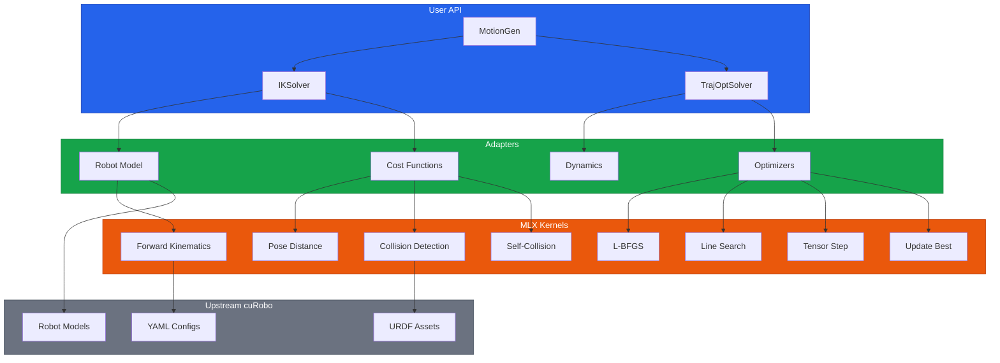
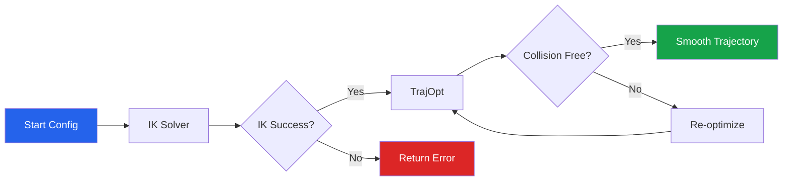

# cuRobo-MLX

[](https://www.python.org/downloads/)
[](LICENSE)
[](https://github.com/ml-explore/mlx)
[]()
[]()

**GPU-accelerated robot motion planning on Apple Silicon.**

A port of [NVIDIA cuRobo](https://github.com/NVlabs/curobo) from CUDA to [MLX](https://github.com/ml-explore/mlx), enabling real-time collision-free trajectory generation on M-series Macs.

Built by [AIFLOW LABS / RobotFlow Labs](https://robotflowlabs.com)

---

## Why cuRobo-MLX

- **No NVIDIA GPU required** -- run production-grade motion planning on any Apple Silicon Mac
- **Adapter architecture, not a fork** -- upstream cuRobo stays read-only as a git submodule; zero merge conflicts on updates
- **12,000 lines of CUDA replaced by 8 pure MLX kernels** -- same algorithms, native Metal acceleration

---

## Install

Requires macOS with Apple Silicon (M1/M2/M3/M4) and Python 3.10+.

```bash
# Clone with upstream submodule
git clone --recursive https://github.com/RobotFlow-Labs/curobo-mlx.git
cd curobo-mlx

# Install with uv (recommended)
uv sync

# Or with pip
pip install -e .
```

---

## Quick Start

### Forward Kinematics

```python
import mlx.core as mx
from curobo_mlx.kernels.kinematics import forward_kinematics_batched

# Compute link poses for 100 joint configurations
q = mx.random.uniform(-3.14, 3.14, (100, 7))
link_poses, link_quats, spheres = forward_kinematics_batched(q, ...)
# link_poses: [100, n_links, 3]
# spheres:    [100, n_spheres, 4]
```

### IK Solving

```python
from curobo_mlx.api import IKSolver
from curobo_mlx.adapters.types import MLXPose
import mlx.core as mx

solver = IKSolver.from_robot_name("franka", num_seeds=32)
goal = MLXPose(
    position=mx.array([0.4, 0.0, 0.5]),
    quaternion=mx.array([1.0, 0.0, 0.0, 0.0]),
)
result = solver.solve(goal)
if result.success:
    print(f"Solution: {result.solution}")
    print(f"Error: {result.position_error * 1000:.1f}mm")
```

### Motion Planning

```python
from curobo_mlx.api import MotionGen
import mlx.core as mx

planner = MotionGen.from_robot_name("franka")
result = planner.plan(start_config, goal_pose)
print(f"Trajectory: {result.trajectory.shape}")  # [T, 7]
```

---

## Architecture

cuRobo-MLX wraps upstream cuRobo through an adapter layer. The upstream repo is a read-only git submodule -- configs, URDFs, and robot definitions are reused directly while all CUDA kernels are replaced with native MLX implementations.



---

## Motion Planning Pipeline



---

## Performance

Benchmarked on Apple M-series (unified memory architecture):

| Operation | B=1 | B=100 | B=1000 |
|---|---|---|---|
| Forward Kinematics (7-DOF) | 1.3 ms | 2.3 ms | 6.0 ms |
| Collision Check (52 spheres x 20 obstacles) | 0.8 ms | 5.9 ms | -- |
| L-BFGS Iteration | 0.2 ms | -- | -- |
| MPPI Iteration (128 particles) | 0.3 ms | -- | -- |

All timings include MLX graph compilation. Batch sizes scale sub-linearly due to Metal GPU parallelism.

---

## CUDA to MLX Kernel Port

Eight CUDA kernel files (approximately 12,000 lines) were replaced by pure MLX implementations:

```mermaid
gantt
    title CUDA Kernel Port -- 12K Lines to 8 MLX Modules
    dateFormat X
    axisFormat %s

    section Geometry
    Forward Kinematics     :done, fk, 0, 2200
    Collision Detection    :done, cd, 0, 2800
    Self-Collision         :done, sc, 0, 1500
    Pose Distance          :done, pd, 0, 1200

    section Optimization
    L-BFGS                 :done, lb, 0, 1800
    Line Search            :done, ls, 0, 1200
    Tensor Step            :done, ts, 0, 800
    Update Best            :done, ub, 0, 500
```



| MLX Kernel | Replaces (CUDA) | Approximate CUDA Lines |
|---|---|---|
| `kinematics.py` | `kinematics_fused_cu.cpp` | ~2,200 |
| `collision.py` | `geom_cu.cpp` (sphere-OBB) | ~2,800 |
| `self_collision.py` | `self_collision_cu.cpp` | ~1,500 |
| `pose_distance.py` | `pose_distance_cu.cpp` | ~1,200 |
| `lbfgs.py` | `lbfgs_cu.cpp` | ~1,800 |
| `line_search.py` | `line_search_cu.cpp` | ~1,200 |
| `tensor_step.py` | `tensor_step_cu.cpp` | ~800 |
| `update_best.py` | `update_best_cu.cpp` | ~500 |
| **Total** | | **~12,000** |

---

## Supported Robots

Any robot with a URDF file is supported. Pre-configured robots from upstream cuRobo:

| Robot | DOF | Config |
|---|---|---|
| Franka Emika Panda | 7 | `franka.yml` |
| Universal Robots UR5e | 6 | `ur5e.yml` |
| Universal Robots UR10e | 6 | `ur10e.yml` |
| Kinova Gen3 | 7 | `kinova_gen3.yml` |
| KUKA iiwa | 7 | `iiwa.yml` |

Additional robots available in `repositories/curobo-upstream/src/curobo/content/configs/robot/`.

---

## Examples

| File | Description |
|---|---|
| [`00_quickstart.py`](examples/00_quickstart.py) | System check -- verify everything works |
| [`01_forward_kinematics.py`](examples/01_forward_kinematics.py) | Batch FK with timing and sweep |
| [`02_collision_checking.py`](examples/02_collision_checking.py) | Sphere-OBB collision detection |
| [`03_ik_solver.py`](examples/03_ik_solver.py) | Inverse kinematics with 32 seeds |
| [`04_self_collision.py`](examples/04_self_collision.py) | Self-collision detection |
| [`05_trajectory_optimization.py`](examples/05_trajectory_optimization.py) | Trajectory optimization pipeline |
| [`06_motion_planning.py`](examples/06_motion_planning.py) | Full IK + TrajOpt pipeline |
| [`07_benchmark_quick.py`](examples/07_benchmark_quick.py) | Performance benchmark on your machine |

```bash
# Start here
uv run python examples/00_quickstart.py
```

---

## Development

```bash
# Install dev dependencies
uv sync --extra dev

# Run tests (343 tests)
uv run pytest tests/ -q

# Run benchmarks
uv run python benchmarks/run_all.py

# Sync upstream cuRobo
cd repositories/curobo-upstream && git pull && cd ../..
```

---

## Project Structure

```
curobo-mlx/
  src/curobo_mlx/
    api/                 # High-level solvers: IKSolver, TrajOpt, MotionGen
    adapters/            # Robot model, cost functions, dynamics, optimizers
      costs/             # Pose, collision, self-collision, bound, stop costs
      optimizers/        # L-BFGS optimizer, MPPI, solver base
    kernels/             # 8 MLX kernels replacing CUDA
    curobolib/           # Drop-in bridge matching upstream cuRobo API
    util/                # Config loading, profiling
  tests/                 # 343 unit and integration tests
  benchmarks/            # Performance benchmarks
  examples/              # Runnable usage examples
  repositories/
    curobo-upstream/     # Upstream cuRobo (read-only submodule)
```

---

## Contributing

Fork, branch, test (`uv run pytest tests/ -q`), and open a PR. Code style: [Ruff](https://docs.astral.sh/ruff/), line length 100.

---

## Citation

If you use this work, please cite both cuRobo and cuRobo-MLX:

```bibtex
@misc{curobo_mlx2026,
    title={cuRobo-MLX: GPU-Accelerated Motion Planning on Apple Silicon},
    author={AIFLOW LABS},
    year={2026},
    url={https://github.com/RobotFlow-Labs/curobo-mlx}
}

@misc{curobo_report23,
    title={cuRobo: Parallelized Collision-Free Minimum-Jerk Robot Motion Generation},
    author={Sundaralingam, Balakumar and others},
    year={2023},
    eprint={2310.17274},
    archivePrefix={arXiv}
}
```

---

## License

MIT -- see [LICENSE](LICENSE).

cuRobo upstream is subject to [NVIDIA's license](https://github.com/NVlabs/curobo/blob/main/LICENSE).
